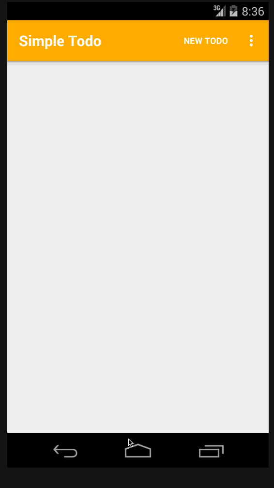
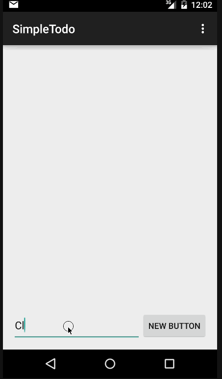

//////////// August 27, 2015

## The following **optional** functionality/features have been completed:

* The todo items now persist in a SQLite database instead of a text file.
* Support for due dates have been added. 
* Support for selecting the priority has been added.
* Added a feature to indicate whether or not an item has been completed.
* Added a feature to filter and display items based on completion status.
* A custom list view adapter is now used to show each item with their due date, priority, and completion status.
* All commands (Save, New Item, etc.) have been moved to the action bar menu.
* All the relevant functionality to modify/add due dates, priorities, etc, have been added to the edit details screen.
* Dialog Fragments are now used to enter new todo items, call the stock date/time picker to edit the due dates.
* Various styles/colors have been implemented to improve the overal look and feel.

## Video Walkthrough 

Here's a walkthrough of implemented new features

GIF created with [LiceCap](http://www.cockos.com/licecap/).

## Notes

The above features were implemented to improve upon the initial application. In addition to all the suggested features, a filtering feature was also added. The feature lets the user filter what items are show based on the completion status of each item. 

After spending some additional time with the Android SDK, I still find it confusing at times. Finding out which resource to target for example when I change the styles, feels like a guessing game. I was not able to find a way change the colors for the date and time picker widgets/dialog fragments if using using a pre android 5.x api. Some folks on StackOverflow are saying those particular resources are not made public so there is no straight-forward way of modifying them.

//////////// First Readme entry

# Pre-work - Simple To-do

Simple To-do is an android app that allows building a todo list and basic todo items management functionality including adding new items, editing and deleting an existing item.

Submitted by: Raymond Chow

Time spent: Maybe 5-10 hours spent in total. Sorry, not quite sure the exact amount of time since I didn't realize we were keeping tabs on time.

## User Stories

The following **required** functionality is completed:

* User can **successfully add and remove items** from the todo list
* User can **tap a todo item in the list and bring up an edit screen for the todo item** and then have any changes to the text reflected in the todo list.
* User can **persist todo items** and retrieve them properly on app restart

## Video Walkthrough 

Here's a walkthrough of implemented user stories:

GIF created with [LiceCap](http://www.cockos.com/licecap/).

## Notes

The above features were to satisfy the initial requirements as instructed. I intend to implement the other optional features and hopefully more after this first submission. As for initial thoughts during this whole process, I do find the Android SDK to be rather convoluted. 
This probably could be attributed to my lack of experience with it though.

## License

    Copyright [2015] [Raymond Chow]

    Licensed under the Apache License, Version 2.0 (the "License");
    you may not use this file except in compliance with the License.
    You may obtain a copy of the License at

        http://www.apache.org/licenses/LICENSE-2.0

    Unless required by applicable law or agreed to in writing, software
    distributed under the License is distributed on an "AS IS" BASIS,
    WITHOUT WARRANTIES OR CONDITIONS OF ANY KIND, either express or implied.
    See the License for the specific language governing permissions and
    limitations under the License.
